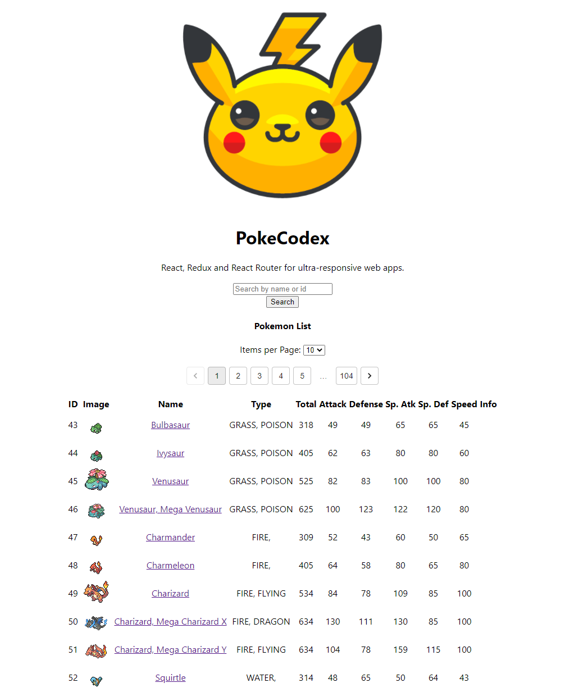
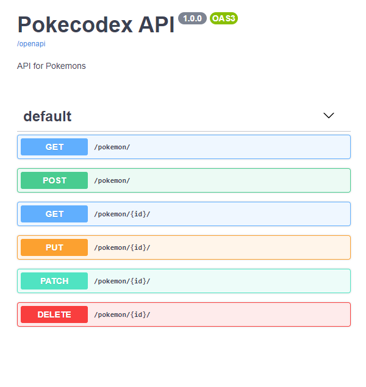

# Pokemon Codex

## Django (Backend) + React (Frontend)

## React App

## Api Root – Django REST framework

## Swagger

## Select Pokemon to change - Django site admin

## You can found more details here:

## [Backend](https://github.com/buzzovi/pokecodex/tree/master/backend)

## [Frontend](https://github.com/buzzovi/pokecodex/tree/master/frontend/pokecodex)
